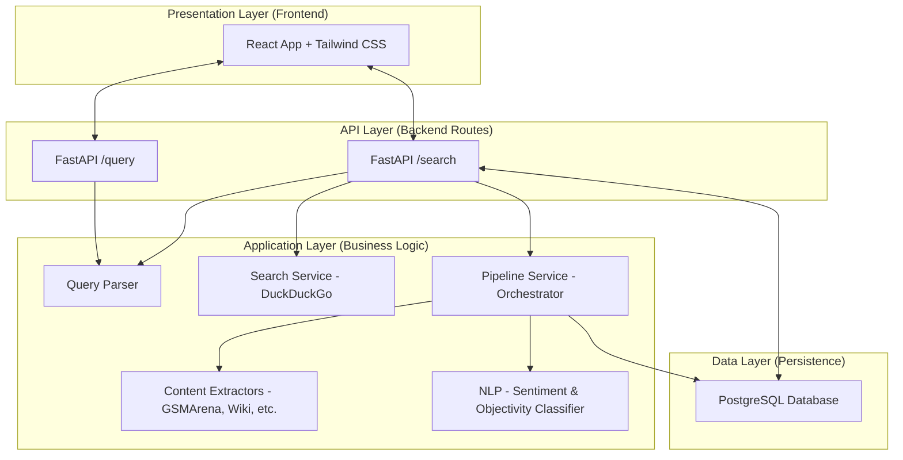

```mermaid
graph TD
    subgraph "Presentation Layer (Frontend)"
        A[React App + Tailwind CSS]
    end

    subgraph "API Layer (Backend Routes)"
        B[FastAPI /search]
        C[FastAPI /query]
    end

    subgraph "Application Layer (Business Logic)"
        D[Query Parser]
        E[Search Service - DuckDuckGo]
        F[Pipeline Service - Orchestrator]  
        G[Content Extractors - GSMArena, Wiki, etc.]
        H[NLP - Sentiment & Objectivity Classifier]
    end

    subgraph "Data Layer (Persistence)"
        I[PostgreSQL Database]
    end

    A <--> B & C
    B & C --> D
    B --> E & F
    F --> G & H
    F --> I
    I <--> B
```