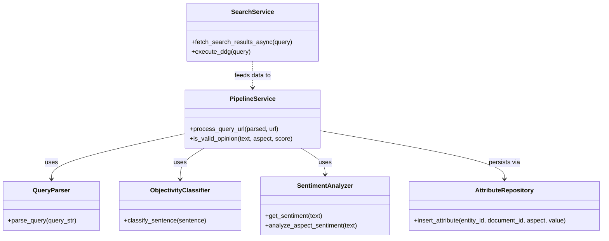

```mermaid
classDiagram
    class SearchService {
        +fetch_search_results_async(query)
        +execute_ddg(query)
    }
    class PipelineService {
        +process_query_url(parsed, url)
        +is_valid_opinion(text, aspect, score)
    }
    class QueryParser {
        +parse_query(query_str)
    }
    class ObjectivityClassifier {
        +classify_sentence(sentence)
    }
    class SentimentAnalyzer {
        +get_sentiment(text)
        +analyze_aspect_sentiment(text)
    }
    class AttributeRepository {
        +insert_attribute(entity_id, document_id, aspect, value)
    }
    
    SearchService ..> PipelineService : feeds data to
    PipelineService --> QueryParser : uses
    PipelineService --> ObjectivityClassifier : uses
    PipelineService --> SentimentAnalyzer : uses
    PipelineService --> AttributeRepository : persists via
```