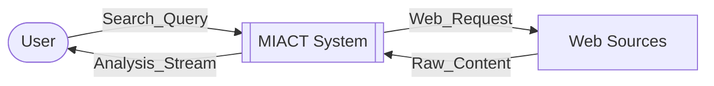
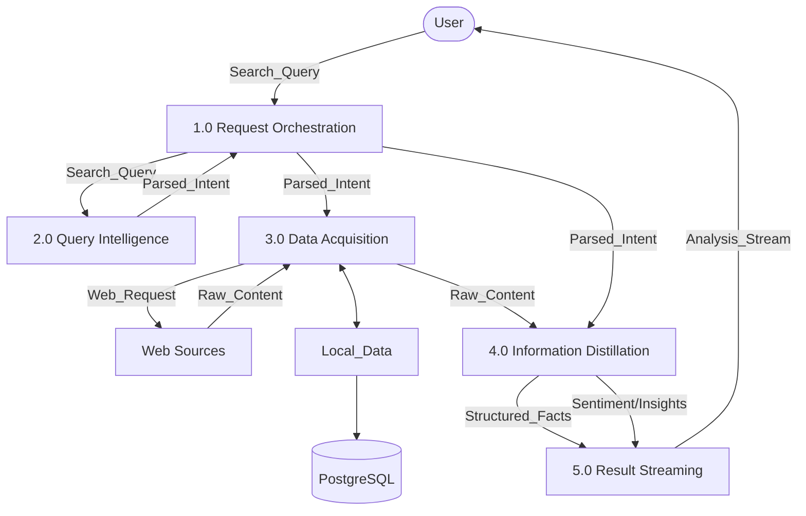
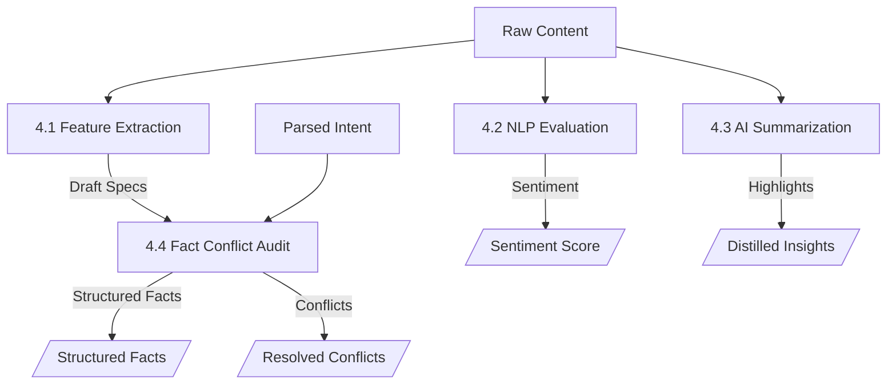

### DFD Level 0: Context Diagram

```mermaid
graph LR
    User([User])
    System[[MIACT System]]
    Sources[Web Sources]

    User -- Search_Query --> System
    System -- Analysis_Stream --> User
    System -- Web_Request --> Sources
    Sources -- Raw_Content --> System
```

### DFD Level 1: Functional Decomposition

```mermaid
graph TD
    User([User])
    Sources[Web Sources]
    DB[(PostgreSQL)]

    P1[1.0 Request Orchestration]
    P2[2.0 Query Intelligence]
    P3[3.0 Data Acquisition]
    P4[4.0 Information Distillation]
    P5[5.0 Result Streaming]

    User -- Search_Query --> P1
    P1 -- Search_Query --> P2
    P2 -- Parsed_Intent --> P1
    P1 -- Parsed_Intent --> P3
    P3 -- Web_Request --> Sources
    Sources -- Raw_Content --> P3
    P3 <--> Local_Data --> DB
    P3 -- Raw_Content --> P4
    P1 -- Parsed_Intent --> P4
    P4 -- Structured_Facts --> P5
    P4 -- Sentiment/Insights --> P5
    P5 -- Analysis_Stream --> User
```

### DFD Level 2: Process 4.0 (Information Distillation)

```mermaid
graph TD
    Raw[Raw Content]
    Intent[Parsed Intent]

    P41[4.1 Feature Extraction]
    P42[4.2 NLP Evaluation]
    P43[4.3 AI Summarization]
    P44[4.4 Fact Conflict Audit]

    Raw --> P41
    Raw --> P42
    Raw --> P43
    P41 -- Draft Specs --> P44
    Intent --> P44
    
    P44 -- Structured Facts --> Out1[/Structured Facts/]
    P44 -- Conflicts --> Out2[/Resolved Conflicts/]
    P42 -- Sentiment --> Out3[/Sentiment Score/]
    P43 -- Highlights --> Out4[/Distilled Insights/]
```
