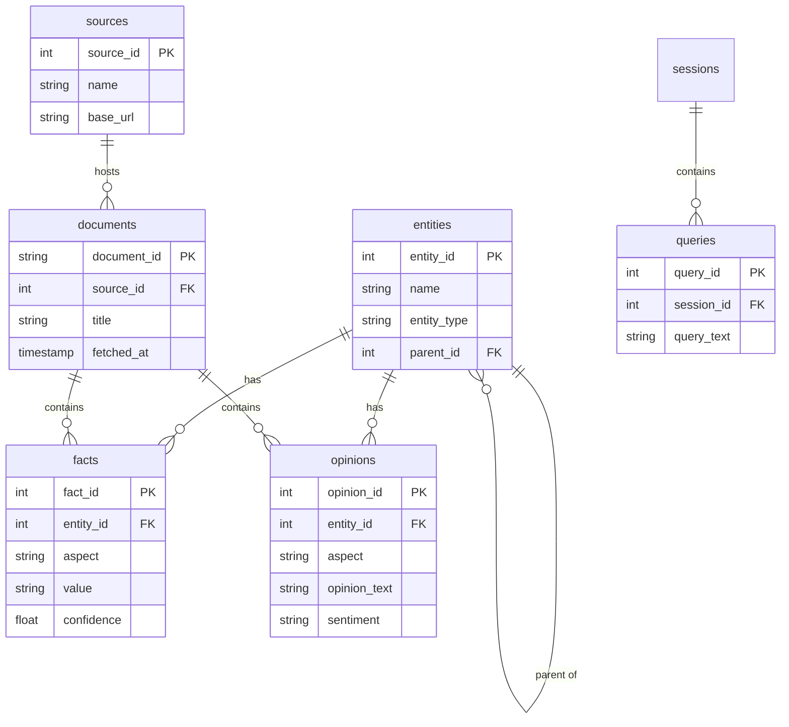

```mermaid
erDiagram
    entities ||--o{ facts : "has"
    entities ||--o{ opinions : "has"
    entities ||--o{ entities : "parent of"
    
    sources ||--o{ documents : "hosts"
    documents ||--o{ facts : "contains"
    documents ||--o{ opinions : "contains"
    
    sessions ||--o{ queries : "contains"
    
    entities {
        int entity_id PK
        string name
        string entity_type
        int parent_id FK
    }
    
    sources {
        int source_id PK
        string name
        string base_url
    }
    
    documents {
        string document_id PK
        int source_id FK
        string title
        timestamp fetched_at
    }
    
    facts {
        int fact_id PK
        int entity_id FK
        string aspect
        string value
        float confidence
    }
    
    opinions {
        int opinion_id PK
        int entity_id FK
        string aspect
        string opinion_text
        string sentiment
    }
    
    queries {
        int query_id PK
        int session_id FK
        string query_text
    }
```
