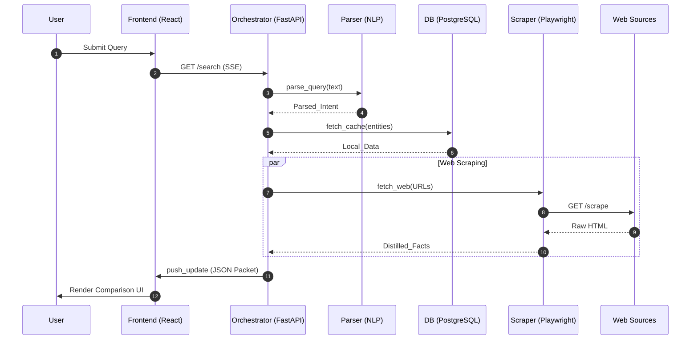

```mermaid
sequenceDiagram
    autonumber
    participant U as User
    participant F as Frontend (React)
    participant O as Orchestrator (FastAPI)
    participant P as Parser (NLP)
    participant D as DB (PostgreSQL)
    participant S as Scraper (Playwright)
    participant W as Web Sources

    U->>F: Submit Query
    F->>O: GET /search (SSE)
    O->>P: parse_query(text)
    P-->>O: Parsed_Intent
    O->>D: fetch_cache(entities)
    D-->>O: Local_Data
    
    par Web Scraping
        O->>S: fetch_web(URLs)
        S->>W: GET /scrape
        W-->>S: Raw HTML
        S-->>O: Distilled_Facts
    end

    O->>F: push_update (JSON Packet)
    F->>U: Render Comparison UI
```
