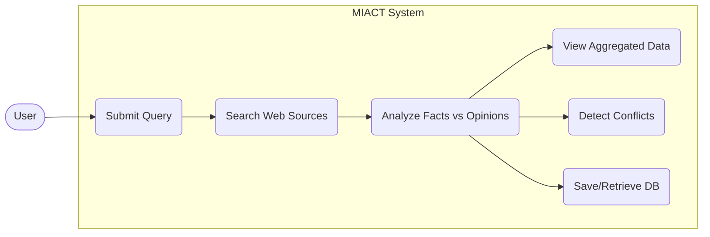

```mermaid
graph LR
    User([User])
    
    subgraph "MIACT System"
        UC1(Submit Query)
        UC2(Search Web Sources)
        UC3(Analyze Facts vs Opinions)
        UC4(View Aggregated Data)
        UC5(Detect Conflicts)
        UC6(Save/Retrieve DB)
    end

    User --> UC1
    UC1 --> UC2
    UC2 --> UC3
    UC3 --> UC5
    UC3 --> UC4
    UC3 --> UC6
```